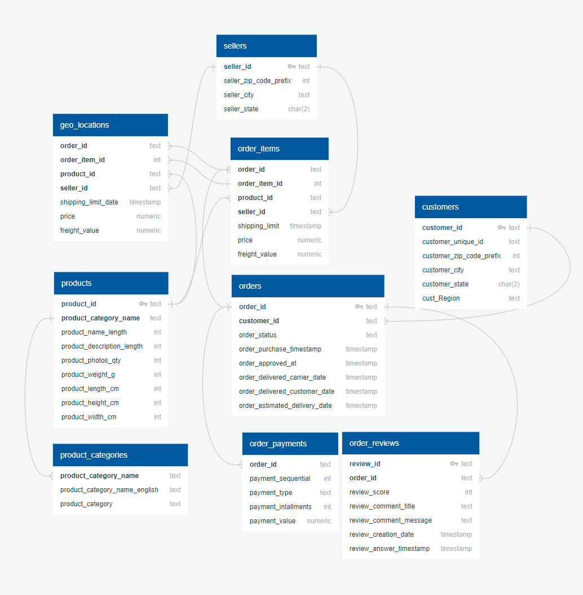

# Olist E-commerce Sales Analysis
An in-depth analysis of Olist's online sales with PostgreSQL, Excel, Python, and Tableau. A presentation sample with recommendations geared towards Sales and Marketing teams.

## Contents
1. [What is Olist?](#what-is-olist?)
2. [Data Structure](#data-structure)
3. [Insights for North Star Metrics](#insights-summary)
4. [Recommendations](#recommendations)
5. [Tableau Dashboard](#dashboard)
6. [Presentation](#presentation-sample)
7. [Citations](#data-source)

## What is Olist?
Olist is a Brazilian online platform that connects micro and small businesses to retailers and marketplaces like Walmart, B2W, Cnova, and more for selling their products. The company enables sellers to manage listings, inventory, orders, shipments and messages at a certain price per month. The shareholders in Olist include 500 Startups, RedPoint Ventures and individual investors such Flavio Dias, CEO of the Original Bank. After 8 funding rounds, Olist has become a Unicorn.

Olist serves in the B2B, SaaS space in the Retail market segments.

## Data Structure
The data contains orders by over 90,000 customers and from over 3,000 sellers, from late 2016 to 2018. A schema is provided below:

## Insights Summary
We focused on the following KPIs:
1. **Sales Growth Rate**: the percentage change in the total sales over 2017 and 2018. We further partition by product category and state.
2. **Average Sales Value**: the average value of the purchases made by a customer. We further partition by product category, state, and payment type.
3. **Average Rating**: the average review score that customers give to their orders. We further partition by category, state, and region to identify areas for improvement.

### Sales Growth Rate
- Overall sales increased **22.26%** from 2017 to 2018.
- Across product categories, **Construction Materials** and **Food and Drinks** experienced the most growth, with **267%** and **126%** respectively. The only categories that experienced a negative growth were the **Entertainment** and **Fashion** categories, with a **3.82%** and **11.75% decrease** respectively.
- The state **Roraima (RR)** experienced the most growth of **247%**, more than **5X** the second-highest sales growth state. There were five states with decrease in total sales value, and the state that experienced the most decrease was **Acre (AC)**, at almost **50% decrease in total sales**.

### Average Sales Value
- **Paraiba (PB)** was the state with the **highest average sales value, at $253.30**. However, **only 556 orders** were made from PB customers. On the other hand, the state with the highest number of orders was **Sao Paulo (SP)**, with **more than 43K orders**, but only a **$140.75 average sales value**.
- The **Construction Materials** category had the highest average sales value of **$254.88**, but *only* had **1389 orders**. On the other hand, the **Electronics** and **Furniture** categories had much lower average sales values of **$174.98 and $153.25** respectively, but with **more than 25K orders each**.

### Average Rating
- The **Food and Drinks** category had the highest average rating of **4.33 out of 5**. In general, most categories had an average rating of 4, so there doesn't seem to be categories with overly positive or negative reviews.
- **Amapa (AP)** is the state with the highest average ratings at **4.24/5**. **Maranhao (MA)** had the lowest average rating, at **3.76**.
- Across the states with average ratings higher than 4/5, the majority were in the Southern regions, with some Northern states. However, **the states with ratings less than 4/5 were almost exclusively in the North and Northeast regions**.

## Recommendations
### **Sales Team Recommendations:**
1. **Focus on High-Growth Categories:**
   - Invest in expanding product lines and marketing efforts for **Construction Materials** and **Food and Drinks**, as these categories are experiencing significant growth.
   - Explore opportunities to revive the **Entertainment** and **Fashion** categories by analyzing market demand and customer preferences to tailor offerings.

2. **Regional Sales Strategy:**
   - Develop targeted sales campaigns in **Roraima (RR)** to capitalize on the region's high growth. Consider partnering with local distributors or expanding product availability.
 

### **Logistics Team Recommendations:**
1. **Optimize Delivery in High Order States:**
   - Enhance logistics and distribution channels in **Sao Paulo (SP)**, which has the highest number of orders, to maintain customer satisfaction and reduce delivery times.
   - Streamline logistics operations in **Paraiba (PB)** to ensure that the high average sales value is supported by efficient delivery, encouraging repeat purchases.

2. **Focus on Regions with Lower Ratings:**
     - Investigate why the states with both the highest and lowest average ratings are located in the North and Northeast regions. Consider starting with carriers and suppliers to analyze product quality and delivery.

### **Marketing Team Recommendations:**
1. **Targeted Advertising Campaigns:**
   - Launch localized advertising campaigns in states and categories with high growth, like **Roraima (RR)** and **Construction Materials**, to further boost brand awareness and capitalize on the growing market.

2. **Revitalize Low-Growth Categories:**
   - Create targeted promotions or bundles for the **Entertainment** and **Fashion** categories to stimulate demand and address the negative growth.

## Dashboard

## Presentation Sample

## Data Source
https://www.kaggle.com/datasets/bhanuprasadchouki/olist-cleaned-files
